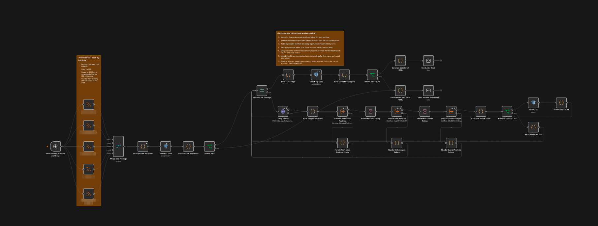

# jobzAI

JobzAI is an n8n-based job-search pipeline that collects LinkedIn postings, evaluates them against a candidate's preferences and experience, stores qualifying results, and sends a current-run email report.

## Workflow architecture

The current implementation is split into one coordinating workflow and three focused analysis sub-workflows under `workflows/`:

| Workflow | Responsibility |
|---|---|
| `Job Searcher.json` | Reads RSS feeds, canonicalizes LinkedIn job IDs, removes duplicates, performs company research, coordinates analysis, persists qualifying jobs, and generates email reports. |
| `Job Searcher - Preference Analysis.json` | Evaluates location eligibility, compensation, culture, growth, domain alignment, and other candidate preferences using posting and research evidence. |
| `Job Searcher - Skill Analysis.json` | Compares the posting's canonical requirements with résumé evidence and calculates a validated skill-fit rating. |
| `Job Searcher - Overall Analysis.json` | Combines validated preference and skill evidence into weighted dimensions and the final apply/no-apply determination. |

### How the workflows interact

1. The main workflow combines the configured LinkedIn RSS feeds and extracts one canonical numeric LinkedIn `job_id` per posting.
2. Existing database IDs and duplicate feed entries are removed before analysis.
3. New jobs are processed one at a time. The main workflow gathers web research (Tavily by default) and builds a shared analysis envelope containing the posting, research, résumé, and run metadata.
4. The main workflow calls the preference, skill, and overall sub-workflows synchronously in that order. Each child validates structured model output before attaching its result to the envelope.
5. The main workflow calculates the final weighted score. Jobs scoring at least `3.0` are upserted into PostgreSQL.
6. After every job has reached a selected, rejected, or failed outcome, the current execution's selected IDs are queried, ranked, and capped at the configured email-report limit (20 by default). Analysis failures are listed separately for manual review.

For installation, first use the [setup instructions](#setup) to generate private personalized copies. Import the three generated analysis sub-workflows before the generated main workflow, then open each Execute Sub-workflow node in `Job Searcher` and select the corresponding child workflow by name.

> **Public-template note:** The committed exports under `workflows/` are inactive, sanitized source templates. Do not import and manually personalize them for an installation. The supported generator replaces candidate data safely while leaving RSS URLs, email addresses, credentials, model selections, and child-workflow references for configuration in n8n.


*Figure 1: JobzAI Workflow Overview*

## Features

- **Automated job collection:** Fetches LinkedIn postings from multiple RSS feeds.
- **Canonical deduplication:** Normalizes LinkedIn URLs into stable numeric job IDs before comparing feed and database records.
- **Evidence-based AI analysis:** Evaluates preference alignment, skill coverage, and weighted overall fit through separate validated sub-workflows.
- **Current-run reporting:** Returns the highest-ranked qualifying jobs from the current execution, up to a configurable limit of 20 by default, rather than selecting from historical results.
- **Visible failure handling:** Lists jobs whose automated analysis failed so they can be reviewed manually.
- **Email notifications:** Sends selected jobs, fit dimensions, evidence summaries, and direct LinkedIn links.

### Email report format

When the current run selects one or more jobs, JobzAI sends a responsive HTML report with a run summary followed by one card per selected job. The default cap is 20 cards, but it is configurable: change `REPORT_LIMIT` at the top of the `Build Run Ledger` Code node. That value is validated, passed as a parameter to `Select Top Jobs`, used for report accounting, and shown in the omission notice, so no other node needs to be edited. Increasing it can produce much larger emails and database results; test the resulting message with your email provider. The separate manual-review lists retain their own 20-item display cap.

Each job card contains the direct LinkedIn link, role details, fit ratings, dimension scores, evidence, preference findings, and skill findings. Jobs whose automated analysis still fails after three attempts appear in a separate manual-review section rather than being silently omitted.

The report follows this structure:

```text
Subject: Job Search Report — [N] current match(es)

Current Job Search Report

Run summary
[Feed items] → [Distinct jobs] → [New jobs] →
[Selected] selected, [Rejected] rejected, [Failed] failed

[Position] at [Company]
View job posting → [LinkedIn URL]

Job ID: [LinkedIn job ID]
Location: [Location]
Salary: [Published salary or Not available]
Posted: [Posted date]

Fit ratings
Overall: [1–5] | Preference: [0–5] | Skill: [1–5]
Explanation: [Concise determination]

Dimension ratings
Employee satisfaction | Salary competitiveness | Remote flexibility |
Skills alignment | Cultural fit

Preference matches
- [Evidence-backed match]

References
- [Supporting source]

Preference misses
- [Evidence-backed miss]

Potential preference matches
- [Unresolved or limited evidence]

Skill matches
- [Supported skill match]

Skill misses
- [Missing requirement]

Transferable skills
- [Relevant transferable experience]

Jobs requiring manual review
- [Job link] — [Failure summary]
```

If the run has no selected jobs, JobzAI sends a shorter status email explaining whether there were no valid feed items, no new jobs, no qualifying jobs, or an incomplete database readback. That message includes run counts plus any invalid feed items or failed analyses requiring review.

## Prerequisites

Before beginning, make sure you can obtain or administer each dependency below. The detailed implementation steps follow in dependency order.

| Requirement | Ready when… | Setup step |
|---|---|---|
| n8n | You can open the workflow editor and import JSON workflows | [Prepare n8n](#n8n) |
| PostgreSQL 12+ or Docker | You have an existing/local/cloud database plus `psql`, or Docker and a Bash-compatible shell for the optional helper-managed container path | [Prepare PostgreSQL](#postgresql) |
| RSS feed source | You have feed URL(s) that expose LinkedIn job results | [Create the RSS feeds](#rss-feeds) |
| Python 3.10+ | You can run the private workflow-personalization generator | [Personalize workflow files](#2-personalize-workflow-files) |
| Git and a Bash-compatible shell | You can run the documented copy, ignore-check, and permission commands (Git Bash is suitable on Windows) | [Personalize workflow files](#2-personalize-workflow-files) |
| Email provider | You have SMTP connection details and permission to send from an address | [Prepare email delivery](#email-delivery) |
| AI model provider | You have API access to suitable chat models through the included OpenAI Chat Model nodes or replacement n8n model nodes | [Prepare AI models](#ai-models) |
| Web search provider | You have a Tavily API key for the unchanged setup, or credentials and API details for an alternative provider | [Prepare web search](#web-search) |

## Setup

Complete these phases in order. Do not activate or schedule the main workflow until the manual end-to-end test in step 5 succeeds.

### 1. Prepare external services

#### n8n

Set up an n8n instance using the deployment method appropriate for your environment. Confirm that you can open the workflow editor, create credentials, and import workflow JSON. See the [n8n documentation](https://docs.n8n.io/) if you do not already have an instance.

> **Compatibility:** The Merge node gained support for more than two inputs in n8n 1.49.0, so this five-feed template requires at least that version. The exact minimum version for every other imported node has not been verified. Use a current n8n release that includes Execute Sub-workflow, PostgreSQL, AI/LangChain chat-model, Basic LLM Chain, and Structured Output Parser nodes. Stop and upgrade or resolve missing nodes if import reports an unsupported node type or version.

#### PostgreSQL

Choose one setup path. All three apply the same `postgres/bootstrap_db.sql` schema.

**Already-provisioned or cloud PostgreSQL:** Install the `psql` client and create or identify two roles: a schema owner used for setup/migrations and a separate least-privilege n8n runtime role. Make the schema-owner role the owner of the PostgreSQL 12+ database. Before bootstrapping, have the provider administrator or current owner of schema `public` prepare it; database ownership alone may not grant this authority on PostgreSQL 12–14 or an upgraded database:

```sql
REVOKE CREATE ON SCHEMA public FROM PUBLIC;
GRANT USAGE, CREATE ON SCHEMA public TO jobzai_owner;
GRANT USAGE ON SCHEMA public TO jobzai_runtime;
```

Adapt the example role names to the roles created by your provider, quoting provider-assigned names when required. Then apply the schema as the owner:

```bash
PGHOST=HOST \
PGPORT=5432 \
PGDATABASE=DATABASE \
PGUSER=jobzai_owner \
  ./postgres/create_cluster.sh existing
```

Let `psql` prompt for the schema-owner password or use an approved libpq credential mechanism such as `.pgpass`; do not place passwords in the command or repository. Set `PGSSLMODE=require` when required by the provider. After setup, grant the runtime table permissions listed below and configure only the runtime role in n8n.

**Optional local Docker database:** If Docker is installed, the helper can create an isolated PostgreSQL container, persistent volume, database, and role, then apply the schema:

```bash
./postgres/create_cluster.sh docker
```

The helper prompts for a password, binds PostgreSQL to `127.0.0.1` only, and never removes its container or volume. Its default `unless-stopped` restart policy starts PostgreSQL again when Docker or the host restarts; set `JOBZAI_POSTGRES_RESTART=no` to opt out. If n8n also runs in Docker, provide an existing shared network with `JOBZAI_DOCKER_NETWORK=NETWORK_NAME`. Run `./postgres/create_cluster.sh help` for every option and environment variable.

For convenience, this local-development path uses one `jobzai` role as both database owner and n8n runtime. Do not copy that elevated role model to a shared, cloud, or production database; use separate schema-owner and runtime roles there.

**Native local PostgreSQL:** Install PostgreSQL using the operating system or PostgreSQL project's supported method. Connect with an administrative role and create separate schema-owner and runtime roles without putting either password in command history:

```text
psql --username ADMIN_ROLE --dbname postgres
postgres=# CREATE ROLE jobzai_owner LOGIN;
postgres=# \password jobzai_owner
postgres=# CREATE ROLE jobzai_runtime LOGIN;
postgres=# \password jobzai_runtime
postgres=# CREATE DATABASE jobzai OWNER jobzai_owner;
postgres=# \connect jobzai ADMIN_ROLE
jobzai=# REVOKE CREATE ON SCHEMA public FROM PUBLIC;
jobzai=# GRANT USAGE, CREATE ON SCHEMA public TO jobzai_owner;
jobzai=# GRANT USAGE ON SCHEMA public TO jobzai_runtime;
jobzai=# \q
```

Run the helper's existing-database mode with `PGDATABASE=jobzai` and `PGUSER=jobzai_owner`. Omit `PGHOST` to use libpq's default local socket, or set `PGHOST=localhost` for TCP. Then, while connected as `jobzai_owner`, grant `CONNECT`, `USAGE`, `SELECT`, `INSERT`, and `UPDATE` to `jobzai_runtime` as shown in [`postgres/README.md`](postgres/README.md). Configure only `jobzai_runtime` in n8n. The helper intentionally does not invoke `sudo` or automate OS package management.

For an existing jobzAI installation, back up the database and identify the table owner before applying an upgrade:

```sql
SELECT tableowner
FROM pg_tables
WHERE schemaname = 'public' AND tablename = 'job_applications';
```

Run the helper as that table owner or a database administrator. Have the owner of schema `public` revoke `CREATE` from `PUBLIC` and grant only the schema privileges shown above. Older jobzAI bootstraps created the table as the PostgreSQL administrator and only granted the n8n role CRUD access; that runtime role cannot perform the required `ALTER TABLE` migration. Migration credentials are temporary administrative credentials—never assign them to n8n. After migration, continue using or create a dedicated n8n runtime role.

Record the runtime role's host, port, database, username, and password for the **Connect workflows and configure the web-interface values** phase. It needs `CONNECT` on the database, `USAGE` on `public`, and `SELECT`, `INSERT`, and `UPDATE` on `public.job_applications`. Grant those privileges after an administrator-run migration if they are not already present. No extension, sequence, or `DELETE` privilege is required.

See [`postgres/README.md`](postgres/README.md) for manual commands, upgrade limits, Docker configuration, and cleanup guidance. The supplied workflows use PostgreSQL nodes and parameterized PostgreSQL queries; another database requires replacing those nodes and adapting the queries.

#### RSS feeds

The workflow is not tied to a specialty or to rss.app. Its five generic `RSS Feed` nodes accept feed URLs for the searches you choose. [rss.app](https://rss.app/) is one convenient way to convert LinkedIn search-results pages into feeds, but another provider or a directly published RSS feed can be used.

Whatever the source, test it in n8n before running the full workflow. Each item must expose a usable LinkedIn job URL in its `link` or `job_url` field because `De-duplicate Job Posts` validates that URL and extracts the numeric LinkedIn job ID. If a provider emits a redirect/wrapper URL or uses a different field, adapt that normalization node before relying on the feed. Also observe the source site's terms and the provider's rate limits.

To create feeds with rss.app:

1. Perform each desired job search on LinkedIn and copy its search-results URL.
2. Create an account at rss.app.
3. Create one LinkedIn RSS feed from each search URL.
4. Confirm that each generated feed returns job entries with direct LinkedIn job links.
5. Save the feed URLs for step 4.

The template starts with five feeds, but the count is editable:

- **Use two to four feeds:** Delete the unwanted RSS nodes and their trigger connections. Connect each retained node to a distinct, contiguous input on `Merge Job Postings`, starting with Input 1, then set the Merge node's `Number of Inputs` to the retained count.
- **Use six to ten feeds:** Duplicate an existing RSS node, give it a unique name and feed URL, connect `When clicking ‘Execute workflow’` (the manual trigger) and any Schedule Trigger to it, increase `Merge Job Postings` → `Number of Inputs`, and connect the new node to the newly exposed distinct input. Repeat as needed.
- **Use one feed:** The Merge node's minimum is two inputs. Remove or bypass `Merge Job Postings` and connect the single RSS node directly to `De-duplicate Job Posts`.
- **Use more than ten feeds:** A single Merge v3 node exposes 2–10 inputs. Group the feeds across multiple Merge nodes in Append mode, then connect those Merge outputs to another Merge node. Every feed must still be connected to each applicable trigger.

After any change, verify that every Merge input has exactly one feed connection, every retained feed is connected to `When clicking ‘Execute workflow’` and any Schedule Trigger, and a manual run reaches `De-duplicate Job Posts`.

#### Email delivery

Choose any SMTP provider supported by n8n and record its host, port, encryption mode, username, password, and permitted sender address.

For Gmail:

1. Enable two-step verification on the sending Google account.
2. Open the account's **App passwords** settings.
3. Generate an app password for n8n and store it securely.
4. Use the generated app password—not the normal account password—when creating the n8n SMTP credential, then assign that credential in step 4.

#### AI models

The analysis workflows use six **OpenAI Chat Model** nodes: a primary model and a fallback/repair model in each of the Preference, Skill, and Overall workflows. The node type does not make OpenAI itself mandatory.

For the fewest changes, use OpenAI or an OpenAI-compatible provider:

1. Obtain an API key from the provider.
2. In n8n, create an **OpenAI** credential. For a compatible third-party provider, set the credential's **Base URL** to its OpenAI-compatible API root.
3. Test the credential so n8n can load the provider's `/models` response, then record the exact model IDs you intend to use.
4. Confirm that the models support chat completions and reliably follow strict structured-JSON instructions. The workflow validators reject malformed or contract-breaking output.
5. Assign the credential and model selection to both model nodes in each analysis workflow.

You may instead replace the included model nodes with n8n's provider-specific chat-model nodes. Preserve both `ai_languageModel` connections into each Basic LLM Chain and the fallback/repair model's connection to the Structured Output Parser. Provider-specific credentials, model options, context limits, and structured-output behavior differ, so replacing the nodes may require additional prompt, parser, or retry changes. Run all three analysis workflows end to end after a replacement.

The exported primary and fallback/repair nodes use the same model ID within each workflow. “Fallback” therefore means a secondary chain attempt and parser-repair path by default, not provider-level redundancy. Configure and test a distinct compatible fallback model if you want that additional resilience.

The exported template currently references `deepseek-v4.1-flash` for Preference and Skill Analysis and `glm-5.3-flash` for Overall Analysis. These are provider model IDs, not requirements; select models that exist at your provider and satisfy the same output contracts.

#### Web search

The `Tavily Search` node in `Job Searcher` is an n8n **HTTP Request** node preconfigured to send a POST request to Tavily's Search API. It is not a provider-specific Tavily node. Its endpoint, Bearer Auth scheme, request body, retry behavior, and downstream response handling are configured, but the public export intentionally omits the credential instance and API key. This makes Tavily the lowest-friction way to start with the unchanged template. As of September 2026, Tavily documents a free plan with 1,000 API credits per month and no credit card requirement; check [Tavily's current credits and pricing](https://docs.tavily.com/documentation/api-credits) before relying on those limits.

Tavily itself is not a hard requirement. You can either reconfigure the HTTP Request node for another search API or replace it with an n8n node for your preferred provider. In either case, authentication, request parameters, rate limits, and response fields may differ.

The downstream Preference Analysis currently expects web research in this shape:

```json
{
  "answer": "Optional search summary",
  "results": [
    {
      "title": "Result title",
      "url": "https://source.example/page",
      "content": "Relevant result text"
    }
  ]
}
```

If the replacement provider returns a different shape, normalize its output before `Build Analysis Envelope` or update that node plus the Preference Analysis prompt and validator. Preserve source URLs: the validator only accepts references that were supplied by the posting or normalized search results. Test the replacement's success and error paths before activating the workflow. Omitting web research entirely is possible because the current error path continues with empty research, but it can leave company signals or strict eligibility requirements unverified and therefore reduce or veto recommendations.

### 2. Personalize workflow files

The recommended path is to generate private workflow copies from the tracked Markdown templates under `data/templates/`. The generator personalizes candidate information only. It deliberately leaves RSS feed URLs, sender and recipient addresses, credentials, model selections, child-workflow references, and provider settings for configuration in n8n.

The generator requires Python 3.10 or newer and no third-party Python packages.

1. Create the ignored private input directory and copy the tracked templates:

   ```bash
   if [ -e data/private ]; then
     echo "data/private already exists; refusing to overwrite it" >&2
     exit 1
   fi
   mkdir -p data/private
   cp data/templates/*.md data/private/
   git check-ignore data/private/resume.md
   ```

   Run this bootstrap block only once. It exits without copying if `data/private` already exists, preventing accidental overwrite of private files. The final command must print `data/private/resume.md` before you enter private information. On POSIX systems, restrict the private copies to the current user:

   ```bash
   chmod 700 data/private
   chmod 600 data/private/*.md
   ```

2. Complete every file under `data/private/`. Remove every `[[...]]` marker and follow the field-specific guidance in [`data/README.md`](data/README.md), including the salary format, hard-gate distinction, consistency checklist, and data-minimization guidance. Do not add API keys, database passwords, SMTP passwords, or other credentials.
3. Validate the private files and the workflow placeholder contract without writing output:

   ```bash
   python3 scripts/personalize_workflows.py --check
   ```

4. Generate inactive private workflow copies:

   ```bash
   python3 scripts/personalize_workflows.py
   ```

   The command writes all four workflows to `personalized-workflows/`. It refuses credential-bearing source workflows and existing output directories, safely encodes multiline résumé content, verifies the location and count of every personal placeholder, and confirms that only the expected RSS and email placeholders remain. See [`data/README.md`](data/README.md) for the supported regeneration lifecycle.

5. Confirm that the private inputs and generated output are ignored:

   ```bash
   git check-ignore data/private/resume.md personalized-workflows/
   ```

Both paths should be printed. Do not import or share generated files until this check succeeds. If you choose a custom output directory, add it to `.gitignore` before generating files there.

The workflow exports under `workflows/` remain the public source of truth. The files under `prompts/system/` and `prompts/user/` mirror the corresponding Basic LLM Chain prompt bodies for easier review, omitting the leading `=` that n8n uses to serialize expression-mode fields and adding the conventional final Markdown newline. Structured Output Parser schemas and Code-node validators remain in the workflow exports and must be reviewed with the prompt files when changing an analysis contract.

Do not place private values in the tracked public exports or use unescaped text replacement against JSON, n8n expressions, or embedded JavaScript. The generator is the supported personalization path.

### 3. Import the workflows

Import the generated files under `personalized-workflows/`. Do not import the public workflow templates for a personalized installation.

Import the three analysis sub-workflows first:

1. `Job Searcher - Preference Analysis.json`
2. `Job Searcher - Skill Analysis.json`
3. `Job Searcher - Overall Analysis.json`

Then import `Job Searcher.json` from the same directory.

All four public and generated exports are inactive and intentionally omit credentials and source-instance workflow IDs.

### 4. Connect workflows and configure the web-interface values

1. In `Job Searcher`, open each Execute Sub-workflow node and select its imported child by name:
   - `Execute Preference Analysis` → `Job Searcher - Preference Analysis`
   - `Execute Skill Analysis` → `Job Searcher - Skill Analysis`
   - `Execute Overall Analysis` → `Job Searcher - Overall Analysis`
2. Open `RSS Feed 1` through `RSS Feed 5` and replace `[RSS_FEED_URL_1]` through `[RSS_FEED_URL_5]` with the desired feed URLs. If you want a different feed count, follow [RSS feeds](#rss-feeds) before testing.
3. In both email nodes, replace `[YOUR_FROM_EMAIL]` and `[YOUR_TO_EMAIL]` with the permitted sender and intended report recipient.
4. Assign the PostgreSQL credential to `Select All Jobs`, `Insert Job`, and `Select Top Jobs`.
5. Assign the SMTP credential to `Send Jobs Email` and `Send No New Jobs Email`.
6. For the unchanged web-search setup, create n8n's generic **Bearer Auth** credential, enter the Tavily API key in its **Bearer Token** field without adding a `Bearer ` prefix, and assign it to `Tavily Search`. For another provider, configure or replace the node as described in [Web search](#web-search).
7. In each analysis workflow, assign your AI-provider credential to both the primary and fallback/repair model nodes, or replace those nodes as described in [AI models](#ai-models).
8. Confirm every imported model selection exists at the configured provider and passes the workflow's structured-output validation.

Also review these non-placeholder defaults:

- the RSS feed count and node names;
- the web-search provider, query, and normalized response shape;
- the `3.0` overall-score threshold;
- `REPORT_LIMIT` in `Build Run Ledger` (20 emailed jobs by default);
- the scoring dimensions and weights.

### 5. Test the installation

Use a test recipient and keep the workflows inactive while testing. Bound external API usage during the first run: use an isolated test database and either a temporary small feed or one pinned representative feed item in an isolated workflow copy. Every new job can invoke the web-search provider and all three AI stages, including retries, so do not begin with a large unprocessed backlog.

1. Execute each retained RSS node and confirm that it returns job entries.
2. Execute through `De-duplicate Job Posts` and identify at least one valid canonical `job_id` that is absent from the test database. Without a new job, the main workflow correctly takes the no-new-jobs path and does not exercise the analysis sub-workflows.
3. Test the PostgreSQL credential, then execute `Select All Jobs` against the initialized test database.
4. From the controlled RSS result, execute through the configured web-search node (`Tavily Search` unless renamed) and confirm that it returns or is normalized to the documented `answer` and `results` shape.
5. Confirm that both email nodes use an address you control as the test recipient.
6. Run `Job Searcher` manually from beginning to end with the controlled new job.
7. Open the three sub-executions from their Execute Sub-workflow nodes and confirm that Preference, Skill, and Overall Analysis each ran and returned a validated structured result. A no-new-jobs email alone is not a complete end-to-end test.
8. Confirm that every new job reaches one outcome—selected, rejected, or failed—and that the resulting email contains only the current run's selected jobs plus any manual-review failures.
9. Remove all pinned test data and restore the intended feed configuration after the end-to-end test succeeds.

Failure-path simulation and malformed-model-response testing are useful hardening checks, but they require additional controlled fixtures and are outside the initial installation path.

### 6. Activate and schedule

1. Add a Schedule Trigger to `Job Searcher` if you want automatic runs; retain `When clicking ‘Execute workflow’` for manual troubleshooting.
2. Connect the Schedule Trigger output to every retained RSS node, mirroring the existing connections from `When clicking ‘Execute workflow’`.
3. Choose a frequency appropriate for the RSS update rate and your provider limits.
4. Save all three child workflows, then activate `Job Searcher` only after the manual test succeeds.
5. Monitor the first scheduled execution and verify its database rows and email report.

## Reviewing results

Each recommendation email includes:

- job title and company;
- preference, skill, and overall ratings;
- key evidence and reasons for the result;
- a direct LinkedIn application link.

If analysis fails after all retries, the job is excluded from automatic scoring and listed separately for manual review.

## Database Schema

The PostgreSQL database uses a single `job_applications` table with the following structure:

| Column | Type | Description |
|--------|------|-------------|
| `job_id` | TEXT (PK) | Unique job identifier |
| `company_name` | TEXT | Company name |
| `position` | TEXT | Job position/title |
| `salary` | TEXT | Salary information |
| `location` | TEXT | Job location |
| `posted_date` | TEXT | Date job was posted |
| `preference_matches` | TEXT | Matched preferences |
| `preference_misses` | TEXT | Missed preferences |
| `potential_preference_matches` | TEXT | Potential matches |
| `preferences_rating` | DOUBLE PRECISION | Preference fit score (0-5) |
| `preference_references` | TEXT | Research references |
| `skill_matches` | TEXT | Matched skills |
| `skill_misses` | TEXT | Missing skills |
| `skill_translations` | TEXT | Transferable skills |
| `skill_rating` | DOUBLE PRECISION | Skill fit score (1-5) |
| `overall_rating` | DOUBLE PRECISION | Overall fit score |
| `years_of_experience` | TEXT | Experience requirements |
| `evaluation` | TEXT | Final determination text |
| `resume` | TEXT | Reserved for future use |
| `joburl` | TEXT | Link to job posting |
| `dim_employee_satisfaction` | DOUBLE PRECISION | Employee satisfaction score (1-5) |
| `dim_salary_competitiveness` | DOUBLE PRECISION | Salary competitiveness score (1-5) |
| `dim_remote_work_flexibility` | DOUBLE PRECISION | Remote flexibility score (1-5) |
| `dim_skills_alignment` | DOUBLE PRECISION | Skills alignment score (1-5) |
| `dim_cultural_fit` | DOUBLE PRECISION | Cultural fit score (1-5) |

See `postgres/bootstrap_db.sql` for the complete schema definition.

## Operational controls

- **Eligibility gate:** The preference workflow requires explicit evidence that a role satisfies the configured remote, hybrid, or on-site arrangement and every mandatory office-geography, relocation, travel, or timezone condition, and that it accepts the candidate's configured location and work jurisdiction. Failed or unverified eligibility produces a preference veto.
- **Overall-score threshold:** `If Overall Score >= 3.0` controls which jobs are persisted and selected. Adjust the node and corresponding prompt language together if you change the threshold.
- **Current-run report cap:** `REPORT_LIMIT` at the top of `Build Run Ledger` controls how many ranked, current-execution jobs can appear in the selected-jobs email. It defaults to `20`; the workflow validates and propagates it to the parameterized PostgreSQL query and report accounting.
- **Retries:** The configured web-search node and each analysis sub-workflow retry up to three total attempts with a two-second delay.
- **Failure visibility:** Jobs that still fail analysis are excluded from automatic scoring but included in the email's manual-review section with their original LinkedIn links.
- **Fail-closed reporting:** The run ledger requires exactly one selected, rejected, or failed outcome for every expected new job ID. Missing, duplicate, or unexpected outcomes stop report generation instead of silently dropping jobs.

## Customization

The pipeline is intentionally modular. Additional feeds, research providers, dimensions, or notification channels can be added, but preserve the canonical `job_id`, one-outcome-per-job ledger, and structured validator contracts when changing the flow.
